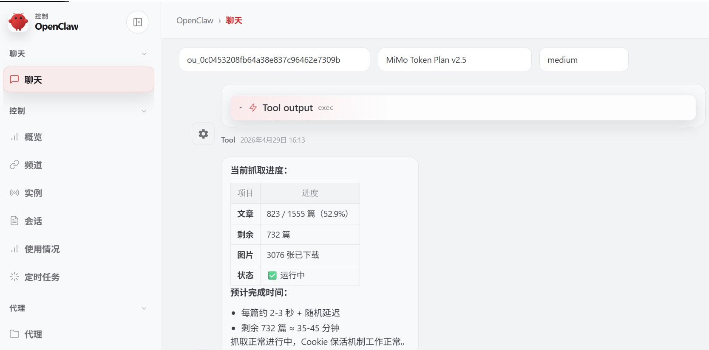
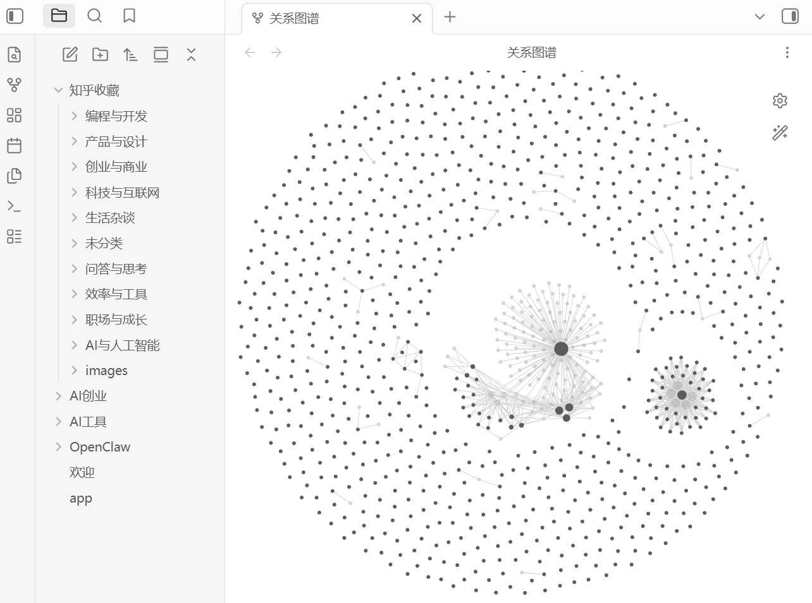

<div align="center">

# 知乎抓取.skill

> 从知乎**收藏夹列表**到**批量正文与图片**，再到 **Obsidian 自动分类入库**：API / Playwright 多级降级、Cookie 持久化与保活、断点续传。

[](LICENSE)
[](https://www.python.org/)
[](https://playwright.dev/)
[](https://agentskills.io)

<br>

收藏夹里上千篇文章想**归档成 Markdown**？<br>
需要**配图本地化**、中断后能**接着抓**？<br>
希望落库到 Obsidian，并**按主题自动分类**？<br>
Cookie 经常失效，想要**持久化上下文 + 保活**？

**本 Skill 按 AgentSkills 约定编排全流程，入口见根目录 [`SKILL.md`](SKILL.md)，脚本集中在 `scripts/`。**

[功能特性](#功能特性) · [运行效果](#运行效果) · [安装](#安装) · [使用](#使用) · [项目结构](#项目结构) · [参考文档](#参考文档)

</div>

---

## 功能特性

| 能力 | 说明 |
|------|------|
| 收藏夹列表 | `zhihu.py collection`：优先 API，失败降级 Playwright DOM；`--collection 名称`、`--since-last` |
| 用户专栏 | `zhihu.py columns`：`--column 名称`、`--since-last`，层级 JSON 可交给 batch |
| 个人文章 / 回答 | `zhihu.py posts`：与专栏按 URL 去重；`--since-last` 只补新；内容更新会 refresh |
| 跟读包 | `zhihu.py follow` / 裸主页 `route`：专栏 + 文章 + 回答 |
| 问题页 | `zhihu.py question`：默认排序回答列表 |
| 统一入口 | `zhihu.py route`：识别 `/collection/` `/columns` `/posts` `/answers` `/question/` `/p/` 回答链接 个人主页 |
| 个人历史列表 | `zhihu.py history`：个人主页点赞/收藏动态，支持时间范围、断点续跑、互动时间元数据 |
| 批量抓取 | `zhihu.py batch`：正文 Markdown、图片默认写入 `{输出目录}/images/`、`_progress.json` 断点续传、失败自动重试、API 回退 |
| Cookie | 持久化浏览器上下文 + 定时保活；失效时用 `zhihu.py relogin` 手动登录 |
| 单篇 / 调试 | `zhihu.py fetch` / `api` / `stealth` / `interactive` |
| Obsidian | `zhihu.py obsidian`：原文镜像到 `{Vault}/知乎收藏/`；`zhihu.py notes`：笔记到并列的 `{Vault}/知乎笔记/` |

**依赖**：见 [`scripts/requirements.txt`](scripts/requirements.txt)，并需 `playwright install chromium`。

---

## 运行效果

<table width="100%" border="1" cellpadding="12" cellspacing="0">
<tr>
<th width="50%" align="center">批量抓取<br><sub>Agent 对话中的进度、剩余篇数与 Cookie 保活（OpenClaw 示例）</sub></th>
<th width="50%" align="center">写入 Obsidian<br><sub>「知乎收藏」主题分类与关系图谱</sub></th>
</tr>
<tr>
<td width="50%" valign="top" align="center">

</td>
<td width="50%" valign="top" align="center">

</td>
</tr>
</table>

---

## 安装

### 加载技能

将本仓库放到 Agent 宿主约定的 skills 路径（与 [`SKILL.md`](SKILL.md) 同级为 skill 根目录），重启后在技能列表中确认已加载。路径因宿主而异，例如 Claude Code、Cursor、OpenClaw 等。

```bash
# 示例：克隆到项目的 skills 目录（按宿主调整目标路径）
git clone https://github.com/handsomestWei/zhihu-fetch-skill.git
```

### 依赖

```bash
cd scripts
pip install -r requirements.txt
playwright install chromium
```

仓库根目录运行测试（访问真实知乎，仅最近少量条目；账号见 `tests/live_profile.py`）：

```bash
python -m pytest
```

抓取上限集中在根目录 [`zhihu_fetch_config.json`](zhihu_fetch_config.json)，运行时优先读配置；对话里改默认用 `python scripts/zhihu.py limits --set key=value`。详情见 [`SKILL.md`](SKILL.md)。

---

## 使用

在 Agent 中用自然语言描述即可，例如：知乎文章、收藏夹、批量抓取、写入 Obsidian、Cookie 失效。

典型三步（默认工作区为技能根下 `zhihu-fetch-workspace/`，可用环境变量 **`ZHIHU_WORKSPACE`** 覆盖，详见 [`SKILL.md`](SKILL.md)）：

```bash
# 1. 收藏夹 → JSON 列表
python scripts/zhihu.py collection <收藏夹URL或ID>

# 2. 批量抓取正文与图片
python scripts/zhihu.py batch <列表.json>

# 3. 原文镜像写入 Obsidian「知乎收藏」（可选 Vault 路径）
python scripts/zhihu.py obsidian <文章目录> [Vault路径]

# 4. 从「知乎收藏」生成并列的「知乎笔记」（不改镜像）
python scripts/zhihu.py notes [Vault路径]
```

用户专栏（`/people/<slug>/columns`，支持 `--column 名称`、`--since-last`）：

```bash
python scripts/zhihu.py route https://www.zhihu.com/people/<slug>/columns --column 远东轶事 --per-column 2
python scripts/zhihu.py batch zhihu-fetch-workspace/zhihu_column_<id>.json
```

个人文章 / 回答（与专栏按 URL 去重）：

```bash
python scripts/zhihu.py route https://www.zhihu.com/people/<slug>/posts
python scripts/zhihu.py route https://www.zhihu.com/people/<slug>/answers --since-last
python scripts/zhihu.py route https://www.zhihu.com/people/<slug>
python scripts/zhihu.py route https://www.zhihu.com/question/<id> --max-items 2
```

收藏夹按名称筛选：

```bash
python scripts/zhihu.py collection https://www.zhihu.com/people/<slug> --per-collection 20 --collection CS --since-last
```

个人历史（点赞 / 收藏）示例：

```bash
# 1. 个人动态 → JSON 列表（起始时间含，结束时间不含）
python scripts/zhihu.py history \
  https://www.zhihu.com/people/<slug> \
  2026-01-01T00:00:00+08:00 \
  runtime/zhihu_history_2026-01-01_to_2026-04-05.json \
  --until 2026-04-05T00:00:00+08:00

# 2. 批量抓取正文与图片（失败默认自动重试 3 次）
python scripts/zhihu.py batch \
  runtime/zhihu_history_2026-01-01_to_2026-04-05.json \
  runtime/zhihu_articles_history_2026-01-01_to_2026-04-05

# 3. 写入 Obsidian 的「知乎收藏/{分类}/」根分类文件夹，按 url 去重更新
python scripts/zhihu.py history-obsidian \
  runtime/zhihu_articles_history_2026-01-01_to_2026-04-05 \
  /path/to/ObsidianVault \
  .
```

Cookie 异常时：

```bash
python scripts/zhihu.py relogin
```

---

## 项目结构

本仓库遵循 [AgentSkills](https://agentskills.io)，根目录即一个 skill：

```
zhihu-fetch-skill/
├── SKILL.md
├── README.md
├── docs/
├── tests/                 # core / fetch / live 与脚本模块对应
├── scripts/
│   ├── zhihu.py           # 唯一 CLI
│   ├── requirements.txt
│   └── zhihu_fetch/       # core, fetch, body, auth, export
└── zhihu-fetch-workspace/
```

默认路径与命令以 [`SKILL.md`](SKILL.md) 为准。

---

## 参考文档

- [技能入口与完整命令说明](SKILL.md)（依赖、脚本表、故障排查）
- [脚本依赖清单](scripts/requirements.txt)

---

<div align="center">

MIT License © [handsomestWei](https://github.com/handsomestWei/)

</div>
